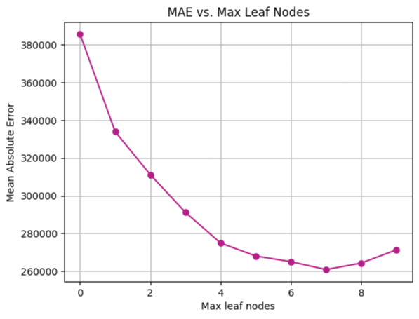

# Melbourne Housing Market Analysis

## Project Overview
This project aims to analyze the Melbourne housing market using a dataset that includes information on property sales across various suburbs. The analysis covers data exploration, visualization, and modeling to understand factors influencing house prices. Specifically, this project seeks to compare the performance of Decision Tree Regressor and Random Forest Regressor models using the Mean Absolute Error (MAE) metric, and also compares MAE results for different values of max leaf nodes to find the optimal model configuration for predicting house prices.

## Dataset
The dataset, `melb_data.csv`, contains details on property sales in Melbourne, including features like suburb, number of rooms, type of property, price, and many others. It provides a comprehensive look at the housing market dynamics in Melbourne.

### Data Attributes
- **Suburb**: Name of the suburb
- **Address**: Address of the property
- **Rooms**: Number of rooms
- **Type**: Property type (h: house, u: unit, etc.)
- **Price**: Sale price
- **Method**: Sale method
- **SellerG**: Selling agent
- **Date**: Date of sale
- **Distance**: Distance from CBD
- **Postcode**: Postal code
- **Bedroom2**: Number of bedrooms (alternative source)
- **Bathroom**: Number of bathrooms
- **Car**: Number of car spots
- **Landsize**: Land size
- **BuildingArea**: Building size
- **YearBuilt**: Year of construction
- **CouncilArea**: Governing council for the area
- **Latitude**: Latitude
- **Longitude**: Longitude
- **Regionname**: General Region (West, North West, North, North east …etc)
- **Propertycount**: Number of properties that exist in the suburb.

## Installation
To run this project, you will need Jupyter Notebook or JupyterLab installed on your system. Additionally, ensure you have Python 3.x installed along with the following libraries:
- Pandas
- NumPy
- Matplotlib
- Scikit-learn

You can install all required packages using the following command:
```
pip install pandas numpy matplotlib seaborn scikit-learn jupyterlab
```

## Usage
1. Clone this repository to your local machine.
2. Open the `housing.ipynb` notebook in JupyterLab or Jupyter Notebook.
3. Run each cell in the notebook to reproduce the analysis and results.
